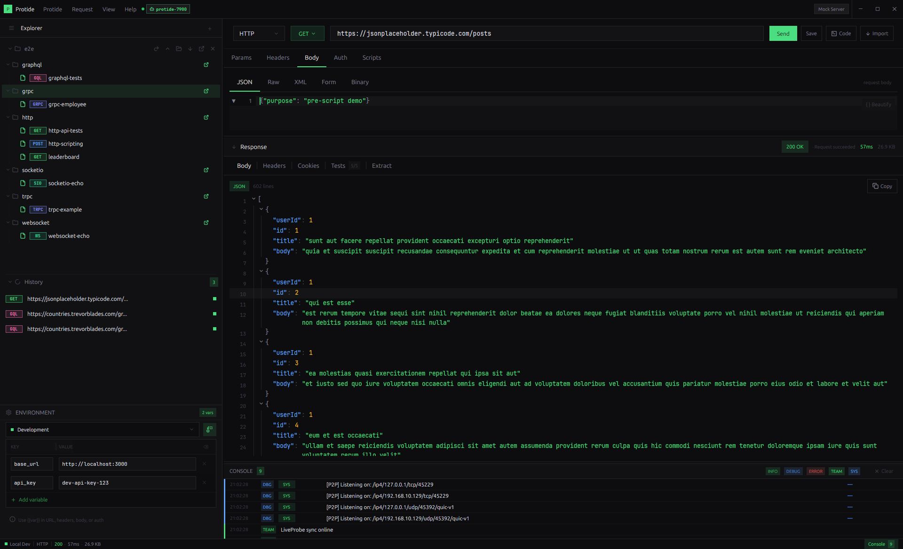

<div align="center">
  

  # Protide

  
  
  

  [Issues](https://github.com/dreygur/protide/issues) • [Releases](https://github.com/dreygur/protide/releases)
</div>

---



## What is Protide?

Protide is a native desktop API testing tool built with **Rust** and [GPUI](https://github.com/zed-industries/zed) - Zed's GPU-accelerated UI framework. It supports HTTP, GraphQL, WebSocket, gRPC, tRPC, and Socket.IO from a single interface.

It ships with a language server (`protide-lsp`) for `.http` files, an MCP server for AI tool integration, and a Zed extension with tree-sitter syntax highlighting.

```bash
cargo install --git https://github.com/dreygur/protide protide-lsp
```

## Features

**Protocols**
- HTTP/HTTPS - GET, POST, PUT, PATCH, DELETE, HEAD, OPTIONS
- GraphQL - query/variables editor with syntax highlighting
- WebSocket - connect/disconnect, send messages, history
- gRPC - proto loading, service/method selection, all streaming types
- tRPC - query and mutation procedures
- Socket.IO - full event support

**Request Editor**
- URL input with method selector
- Headers, query params, body (JSON, Raw, XML, Form, Binary)
- Authentication - Bearer, Basic, API Key (header or query)
- Environment variables with `{{variable}}` substitution
- Code generation - cURL, Python, JavaScript, Go, Rust

**Collections & Storage**
- File-based collections (folders = collections, `.http` files = requests)
- Request history panel
- Import: cURL, Postman, Bruno, OpenAPI/Swagger
- Export: Markdown

**Scripting & Testing**
- JavaScript pre/post-request scripts (via [rquickjs](https://github.com/DelSkayn/rquickjs))
- Test assertions with `expect()` API
- Request chaining via JSONPath + `# @set` annotations

**Mock Server**
- Local HTTP mock server with configurable routes
- Record/proxy mode - forwards to real server, captures responses as static routes

**Collaboration**
- CRDT-based local-first sync (LWW registers, Lamport timestamps)
- P2P via [libp2p](https://libp2p.io/) - mDNS discovery + Gossipsub
- Bring-your-own-backend file sync (Dropbox, Google Drive, GitHub)
- PAKE secure pairing for LAN peers

**Tooling**
- **LSP** (`protide-lsp`) - hover, completion, diagnostics, formatting, semantic tokens, rename, code actions for `.http` files
- **MCP server** (`protide-mcp`) - JSON-RPC 2.0 over stdio, exposes `send_request` tool for AI assistants
- **Zed extension** - syntax highlighting with tree-sitter, LSP integration

## Installation

### Build from source

```bash
git clone https://github.com/dreygur/protide
cd protide
cargo build --release
./target/release/protide
```

**Linux dependencies:**

```bash
sudo apt-get install -y \
  libgtk-3-dev libwebkit2gtk-4.1-dev \
  libxkbcommon-dev libxkbcommon-x11-dev \
  libwayland-dev libx11-dev \
  libxcb-shm0-dev libxcb-xfixes0-dev libxcb-shape0-dev \
  libasound2-dev libfontconfig-dev libudev-dev \
  libegl1-mesa-dev mesa-common-dev
```

### LSP

```bash
cargo install --git https://github.com/dreygur/protide protide-lsp
```

**Zed:** Install the *Protide HTTP* dev extension from `extensions/zed/`.

## .http File Format

```http
### List posts
# @name list-posts
# @description Fetch all posts from the API
# @protocol http

GET {{base_url}}/posts
Authorization: Bearer {{token}}

> 
```

| Annotation | Description |
|---|---|
| `# @name` | Request name (used for chaining) |
| `# @description` | Human-readable description |
| `# @protocol` | Protocol hint (`http`, `graphql`, `ws`, `grpc`) |
| `# @set var = $.path` | Extract response value into variable |
| `# @depends name` | Declare dependency on another named request |
| `# @tests` | Inline test block |

## License

MIT
